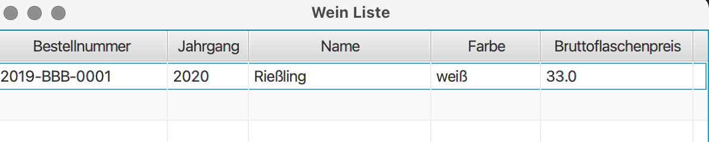

# Mensch-Computer-Interaktionen university practise

This little project was made as part of the Mensch-Computer-Interaktionen course.


## Compile and start the program with maven

It should be runnable with this command.

```sh
mvn compile exec:java
```

## Screenshots

Weineingabe:


Trinkreifediagramm für einen Wein auf Basis der angegeben maximalen Lagerdauer:


Liste aller eingegebenen Weine:


